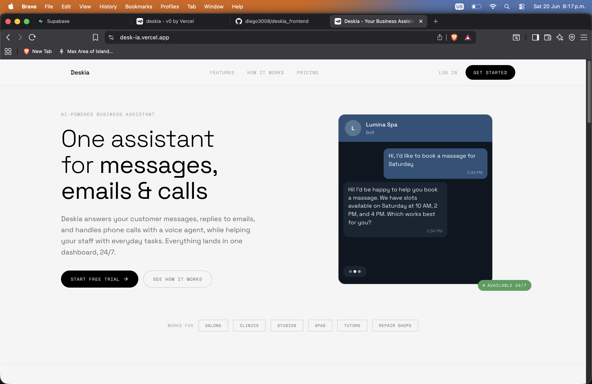
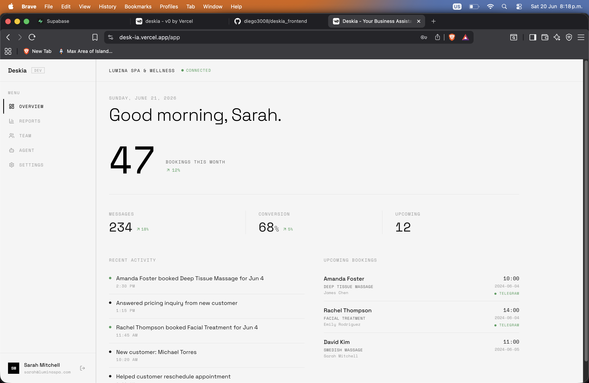
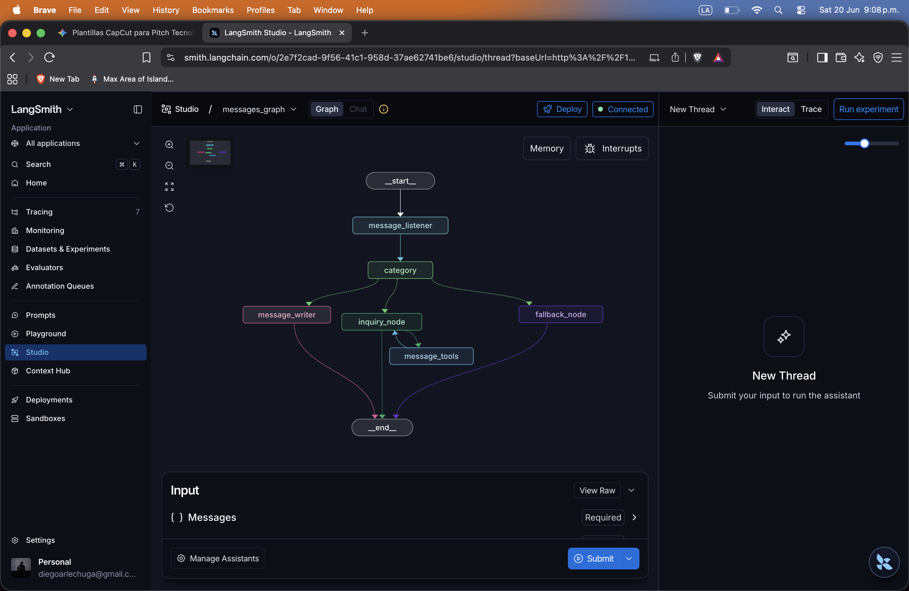
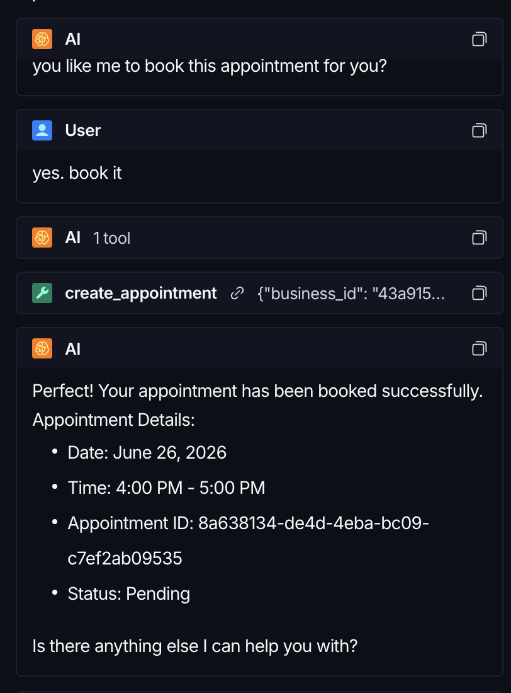

# Deskia — AI Business Assistant

Deskia is an AI agent that handles customer conversations on behalf of businesses — so no message goes unanswered, and no booking gets missed.

---

## What it does today

When a customer sends a message, Deskia reads it, figures out what they want, and responds appropriately — without a human in the loop.

The pipeline works like this:

1. **Receives the message** — a customer sends a Telegram message to a business (e.g. "I'd like to book a massage for Saturday")
2. **Categorizes the intent** — the agent classifies it: greeting, enquiry, booking request, or something it can't handle
3. **Takes action** — depending on the category:
    - Greets the customer and introduces itself as Deskia
    - Looks up available appointment slots via the business's API
    - Books an appointment when a time is confirmed
    - Falls back gracefully when the request is outside its scope
4. **Replies** — sends a natural, on-brand response back to the customer

The business owner sees all of this reflected in their dashboard: bookings, messages handled, and upcoming appointments — updated in real time.

---

## The product

### Landing page

One assistant for messages, emails, and calls. Deskia answers customer messages, books appointments, and handles pricing inquiries — 24/7, across every channel.

---

### Business dashboard

Business owners get a live overview: total bookings this month, messages handled, conversion rate, and the next upcoming appointments — all in one place.

---

### Agent graph

Under the hood, the agent runs as a LangGraph graph. Each node has a clear responsibility: listen → categorize → act (write, inquire, or fall back) → end. The graph is inspectable and traceable in LangSmith Studio.

When a customer confirms a booking, the agent calls the `create_appointment` tool and responds with the full appointment details:

---

## Current scope

Deskia is actively handling **Telegram message flows** for appointment-based businesses (spas, clinics, studios). Right now it can:

- Greet customers and introduce itself
- Answer scheduling questions by checking real availability
- Book appointments end-to-end
- Fall back politely when a request is outside its scope

---

## What's next

- **Cancel and reschedule appointments** — let customers modify existing bookings through the same conversation flow
- **Context window management** — figure out the right strategy for starting new threads so long conversations don't degrade the agent's ability to reason (summarization, thread handoff, or windowed memory)
- **More business types and channels** — expand beyond Telegram and appointment-based businesses
