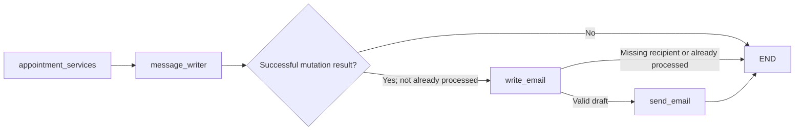

# Appointment Email Confirmation — Feature Specification

Date: 2026-09-08

Status: Implemented and verified with 93 passing mocked tests. Live email activation still depends on the pending appointment APIs and sender setup.

Plan: [Implementation checklist](../plans/2026-09-08-appointment-email-confirmation.md)

## Goal

Finish the booking workflow by emailing the identified customer after a backend-confirmed booking, reschedule, or cancellation. Availability checks, appointment viewing, clarification, failed operations, and the existing API-pending nodes must never trigger confirmation email.

## Findings before implementation

- `src/utils/gmail_utils.py` had OAuth setup but `send_email()` was empty. It imported nonexistent `Email` from `src.state`, requested `gmail.modify`, and could start an interactive browser server during a request.
- `src/graph/email_confirmation_subgraph.py` imported nonexistent `GraphState` and unused tools/RAG symbols, registered nodes without callables, and assigned `graph` locally rather than `self.graph`. These prevented the parent from importing and compiling successfully.
- The parent already imported and registered `email_confirmation`, but no edge entered it. Both `message_writer` and the unused email node led directly to `END`.
- The five current appointment nodes return API-pending messages. None publishes an authoritative success result. `appointment_intent` and conversational gates are cleared on completion, and neither an intent nor an assistant sentence is proof of backend success.
- The required Google libraries are already declared in `pyproject.toml` and `uv.lock`.

## Chosen approach

Use a typed operation result, deterministic Spanish email templates, and the existing two-node email subgraph. Preserve the normal chat response before running the finishing step:

The `write_email` and `send_email` nodes live inside `email_confirmation`. Email nodes do not add messages to conversation history or overwrite `message_response`; the existing booking response remains intact even if Gmail fails. The overall graph waits for the email attempt before returning; this is not background delivery.

Alternatives considered:

1. **Recommended: finish the current graph with two small nodes.** Fits the files already added and isolates Gmail failure from the appointment result.
2. **Call Gmail directly from each appointment node.** Duplicates notification logic and couples business mutations to transport failures.
3. **Transactional outbox and worker.** Appropriate for durable retries and multiple workers, but requires backend/storage integration not available in the current API-pending phase.

## Success contract

Add `AppointmentOutcome` in `src/models/appointments.py`, using Pydantic directly for the new model. It contains:

| Field | Contract |
| --- | --- |
| `status` | Exactly `succeeded`; failed/pending results are ineligible |
| `operation` | `booked`, `rescheduled`, or `cancelled` |
| `operation_id` | Stable, nonempty identifier for this committed mutation, not merely the appointment ID |
| `appointment_id` | Nonempty backend appointment identifier |
| `business_id`, `customer_id` | Nonempty strings identifying the tenant and customer |
| `recipient_email` | Snapshot of the identified customer's email; optional so a missing address does not invalidate the appointment result |
| `starts_at`, `ends_at`, `previous_starts_at` | Optional timezone-aware datetimes; start required for booking/rescheduling, end after start if supplied |

The API-facing operation node creates this result only after the backend has confirmed the mutation. Copy recipient and ownership from trusted customer/backend data, never from an LLM-generated email or arbitrary request text. On cancellation, retain the appointment ID and any available pre-cancellation date before clearing conversational state; no read-after-delete is required.

Email eligibility revalidates the result and matches its business/customer IDs to the current state. Each reschedule must have its own mutation ID, even when the appointment ID is unchanged. Prefer a backend operation ID or revision; if absent, create the operation ID once before the mutation and retain it across retries. Do not generate a new ID in the email node.

**Integration boundary:** current appointment APIs remain pending. This feature can be implemented and verified with mocked successful operation results, but live confirmations remain inactive until the real mutation nodes emit this contract. Do not reconnect legacy tools or fabricate successful outcomes to make email reachable.

## State and lifecycle

Add four channels to `MessageGraphState`:

- `appointment_outcome: dict | None`: serialized `AppointmentOutcome` produced by the current operation.
- `email_draft: dict | None`: `{to, subject, body}` generated by `write_email`.
- `email_confirmation: dict | None`: current result containing `operation_id`, `status`, and optional Gmail message ID/reason.
- `email_receipts: dict[str, dict]`: processed operation IDs and their results for the current thread.

At the start of each new human turn, `message_listener_node` clears the first three channels and preserves `email_receipts`. `clear_appointment_state()` additionally clears `appointment_outcome` so pending/clarification paths cannot carry an old success. Future mutation success returns its result **after** applying the normal reset. This result is distinct from appointment intent and survives its reset.

The receipt statuses are `sent`, `skipped`, `failed`, and `unknown`. `sent` means Gmail returned a nonempty message ID; it does not prove inbox delivery. Missing recipient produces `skipped`; invalid content/configuration and definite Gmail rejection produce `failed`; transport errors, ambiguous server responses, or a missing response ID produce `unknown`. Record a sanitized reason code without tokens or raw provider responses.

## Duplicate suppression and retries

Before composing or sending, check `email_receipts[operation_id]`. A saved receipt, regardless of status, suppresses another automatic attempt. Record one result per operation and retain the receipt across subsequent turns. Different operation IDs produce different confirmations.

No application retry loop or automatic Gmail send retry is added. An email failure must never rerun the appointment mutation. An operator-controlled resend is separate work.

This is **thread-state duplicate suppression**, not exactly-once delivery: it requires retained LangGraph state, does not coordinate different threads/workers, and cannot close a crash window after Gmail accepts mail but before the receipt is checkpointed. A stable Message-ID is not a Gmail deduplication guarantee. Add a backend outbox with a unique operation key when durable delivery/concurrent processing is required. Use a `ponytail:` comment to state this known ceiling in the receipt helper.

## Gmail utility and setup

Assume one configured sender account per deployed worker, matching the current single-token utility. Multi-business sender-account selection is outside this phase. Recipient scope still follows the outcome's business/customer IDs.

- Use `email.message.EmailMessage`, UTF-8 plain text, and base64url encoding with `users().messages().send(userId="me", body={"raw": ...})`. Return the Gmail message ID. [Google sending guide](https://developers.google.com/workspace/gmail/api/guides/sending), [send reference](https://developers.google.com/workspace/gmail/api/reference/rest/v1/users.messages/send).
- Request `https://www.googleapis.com/auth/gmail.send` for the sender setup rather than mailbox modification access. Existing tokens may need explicit reauthorization for the configured scopes. [Gmail scopes](https://developers.google.com/workspace/gmail/api/auth/scopes).
- Read `GMAIL_SENDER_EMAIL`, `GMAIL_TOKEN_PATH` (default `token.json`), and `GMAIL_CREDENTIALS_PATH` (default `credentials.json`). Sender must be the authenticated account or a configured authorized send-as address.
- `_get_gmail_service()` loads an existing token and refreshes it in memory if possible. Missing, malformed, revoked, or unusable authorization becomes a controlled configuration error. No OAuth browser flow, credential printing, or token-file writes in a graph request.
- Move the interactive flow to an explicit `authorize_gmail()` command (`python -m src.utils.gmail_utils --authorize`) for an operator to run separately. Save its token with owner-only file permissions. Follow Google's setup prerequisites; do not run authorization in implementation/tests. [Python setup guide](https://developers.google.com/workspace/gmail/api/quickstart/python).
- Run blocking Google-client work with `asyncio.to_thread` from the async send node. Build and close the client within that call; use the already installed authorized HTTP transport with a finite 30-second send timeout.
- Validate a single recipient address and sender using stdlib address parsing and reject CR/LF in headers before sending. Do not add CC/BCC, attachments, HTML, an LLM writer, or a provider abstraction.

## Email contents

| Operation | Subject | Body |
| --- | --- | --- |
| `booked` | `Confirmación de cita` | Booking confirmation, appointment ID, confirmed start; end if supplied |
| `rescheduled` | `Cita reprogramada` | Rescheduling confirmation, appointment ID, new start; previous start/end only if supplied |
| `cancelled` | `Cita cancelada` | Cancellation confirmation and appointment ID; cancelled slot if supplied |

Render the backend's timezone offset explicitly. Do not infer local timezone, appointment duration, business name, cancellation reason, or other absent fields.

## Acceptance and scope

1. Both new modules import and the parent compiles without OAuth/network side effects.
2. Only valid, matching, backend-successful mutation results route to email; all pending/read-only/failed/ambiguous cases skip it.
3. All three email templates use the correct committed data and recipient.
4. Missing recipients, bad credentials, Gmail rejection, and uncertain delivery preserve the appointment outcome and chat response.
5. Same-operation replay with a saved receipt does not resend; a new operation ID can send. The crash/concurrency limit is documented.
6. MIME payload, Gmail message ID, state cleanup, and compiled parent/subgraph routing are covered with mocked tests.
7. Existing 66 authorized appointment/customer/compaction checks remain passing after their intentionally changed topology/listener assertions are updated.

## Global constraints

- Preserve the user's unfinished Gmail/email-subgraph work, prior appointment implementation, dependency edits, RAG edits, and deleted email_support_graph.py; do not restore or overwrite unrelated work.
- Keep appointment APIs pending; never infer operation success from intent, slot availability, or assistant text.
- Reuse the declared Google libraries and Python standard library; no new dependencies or notification framework.
- Keep emails in Spanish and preserve the existing chat response/history.
- No live emails or OAuth authorization during planning, implementation, or automated tests without separate explicit authorization.
- Existing authorization covers the appointment, pending-question, and compaction checks; request authorization before running the new Gmail/email tests, per AGENTS.md.

## Implementation and verification

The finishing step is implemented: `appointment_services → message_writer → conditional email_confirmation → END`. It uses the validated `AppointmentOutcome`, preserves the chat response/history and appointment result, and records notification status separately. Existing API-pending nodes produce no success outcome and never send email.

The main agent ran all five authorized test modules together with `.env` loading and tracing disabled:

| Test module | Passing tests |
| --- | ---: |
| `tests/test_gmail_utils.py` | 11 |
| `tests/test_email_confirmation.py` | 16 |
| `tests/test_appointment_services_subgraph.py` | 33 |
| `tests/test_pending_question_flow.py` | 31 |
| `tests/test_compact_context_node.py` | 2 |
| **Total** | **93** |

The run exited with code 0; `git diff --check` passed. Validation used mocked senders, APIs and models plus synthetic token files. No live mail or OAuth authorization was performed. Existing dependency, lockfile, RAG and prompt changes were preserved.

To activate later, configure the sender account and have each real successful mutation emit its serialized `AppointmentOutcome` after the shared state reset. The explicit operator authorization command is `uv run python -m src.utils.gmail_utils --authorize`; it was not run during implementation. Thread-state receipts retain the documented crash/concurrency limitation; durable delivery requires the deferred backend outbox.
