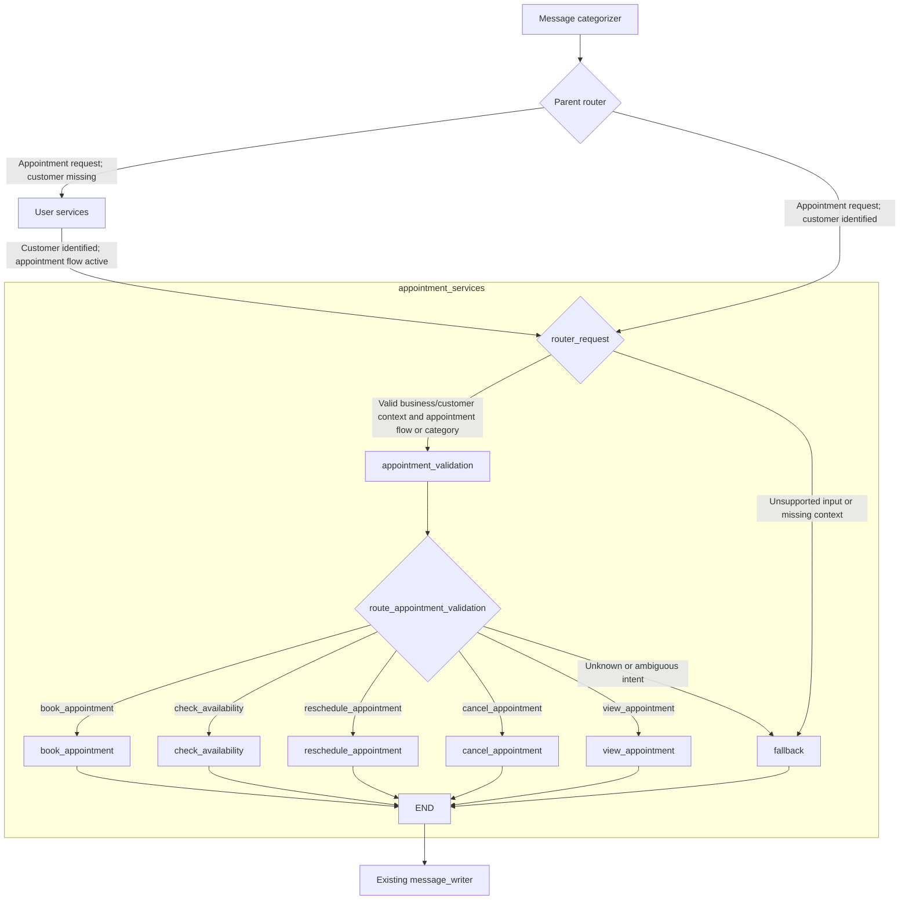

# Appointment Services Routing — Feature Specification

Date: 2026-09-08

Status: Implemented on 2026-09-08; 66 authorized regression checks passed. Appointment API integrations remain pending.

Implementation plan: [Appointment Services Routing](../plans/2026-09-08-appointment-services-routing.md)

## Goal

Restructure `appointment_services` to follow the explicit router → validation → operation-node pattern used by `user_services`. Support booking, availability checks, rescheduling, cancellation, and viewing appointments. Appointment API integration remains pending by request.

## Previous behavior and reasons for changing it

- `src/graph/user_services_validation_subgraph.py` defines an entry router, a validation node, a router that reads `next_action`, and separate customer-operation nodes registered through a local `NODES` dictionary.
- `src/graph/appointment_services_subgraph.py` ran `appointment_agent → tools → appointment_agent`. The agent chose among four existing HTTP tools; cancellation had no tool.
- `src/graph/appointment_booking_graph.py` recognized only new appointments and rescheduling as appointment categories. Cancellation went through user services but did not reliably reach appointment services afterward.
- `src/nodes/message_categorizer_node.py` treated cancellation as a flow exit. The categorizer prompt grouped availability with new appointments and had no category for viewing appointments.
- Customer identification spans multiple messages. A later category such as `confirmation` can replace the original category, so the requested appointment action must survive independently.
- `message_writer_node` already passes through a final `AIMessage` without another LLM call. Reuse that behavior for clarification and API-pending responses.

## Approach

Use the existing structured message categorizer for natural-language interpretation, then validate its category and saved appointment intent deterministically inside the subgraph. This gives the requested validation boundary without paying for a second classifier call.

Alternatives considered:

1. **Recommended: explicit nodes with deterministic intent validation.** Reuses the existing classifier and mirrors user services; requires two new message categories and a small shared category-to-action map.
2. **A second appointment-specific LLM classifier.** Could independently reassess ambiguous language, but duplicates classification and introduces another failure path. Add only if real classification failures justify it.
3. **Retain the tool loop and add more tools.** Small initial change, but does not provide the requested explicit operation-node structure and would keep consuming appointment APIs.

## Workflow

All five actions retain the existing customer-identification prerequisite, including availability. Public availability without identifying a customer is a separate policy change. Customer APIs remain in the existing user-services flow; only appointment API consumption is deferred here.

## Intent contract

Keep existing category names and add `check_availability` and `view_appointment` to `MessageCategory`. Define `APPOINTMENT_INTENTS` in `src/structured_outputs.py` so the categorizer, graphs, and validation node use one mapping:

| Message category | Appointment intent / operation node | Meaning |
| --- | --- | --- |
| `new_appointment` | `book_appointment` | Explicit request to make a new booking |
| `check_availability` | `check_availability` | Ask whether dates or time slots are free, without authorizing a booking |
| `reschedule_appointment` | `reschedule_appointment` | Move an existing booking |
| `cancel_appointment` | `cancel_appointment` | Cancel an existing booking |
| `view_appointment` | `view_appointment` | Ask to see an existing booking or its details |

Service descriptions, prices, and whether a treatment is offered remain `service_inquiry`. “No, gracias” remains `decline`; it must not cancel an appointment. When multiple incompatible actions have no clear dominant intent, use existing `service_request` and clarify rather than select an operation. A generic affirmation alone does not establish an appointment intent.

Add `appointment_intent: str | None` to both `MessageGraphState` and `UserValidationState`. The parent state retains the intent across customer identification. Keep `MessageGraphState` as the appointment subgraph schema; do not create a duplicate state schema. Permit `None` in `next_action` annotations for these two states, matching existing runtime resets.

Validation precedence:

1. Require a business ID and an identified customer (`customer_id` or `customer.id`) at the subgraph entry. Direct subgraph calls with missing context terminate through fallback; the parent owns customer identification.
2. A recognized current appointment category supplies the operation and overrides a saved intent.
3. A successful customer-identification handoff (`next_action == "collect_appointment_details"` with `customer_status` equal to `existing` or `new`) resumes the saved, allowlisted intent while the appointment flow is active. This handles email/name replies whose category does not express an appointment action.
4. Otherwise, only `confirmation` may resume a saved, allowlisted intent, and only while `current_flow == "appointment_services"`. Unknown, empty, unsupported, ambiguous, and unrelated categories clarify even if `next_action` contains a stale operation.
5. Dispatch only an allowlisted `next_action` produced by validation. Never route directly from arbitrary persisted state to an operation node.

The model remains responsible for language understanding. Deterministic validation checks the structured result and workflow context; it is not a second independent interpretation of the raw message.

## State lifecycle and parent integration

- Recognized appointment categories set `current_flow = "appointment_services"` and save the mapped intent before entering user services.
- Changing to a different appointment action clears `active_appointment`, `confirmed_slot`, and obsolete appointment `next_action`/questions. Preserve active customer-identification questions and retry actions so the identity flow can finish before executing the newly selected intent.
- Customer questions and customer retry actions keep their existing routing precedence. Extend both the user-services entry router and `user_validations_node` to accept all five categories.
- Greeting, complaint, feedback, decline, and service inquiry clear appointment intent and flow state. Service inquiry then enters its existing services-inquiry path. Cancellation becomes an appointment action rather than an exit.
- Generic `service_request` enters the appointment path, with customer identification if needed, so ambiguous appointment requests can reach clarification. Clear saved intent for a new ambiguous request; preserve it when processing an unfinished customer-identification question/retry. User validation must accept this category as well.
- For valid context but unclear intent, fallback emits a Spanish clarification listing the five supported actions, sets `pending_question = "appointment_intent"`, sets `next_action = "clarify_appointment_intent"`, keeps the appointment flow active, and clears the saved intent and stale appointment gates.
- Missing business/customer context produces a Spanish validation-required response, clears appointment flow state, and terminates. It does not call customer or appointment APIs from this subgraph.
- Each pending operation clears `current_flow`, `appointment_intent`, `pending_question`, `next_action`, `active_appointment`, and `confirmed_slot` and returns one final `AIMessage`. Retain customer, business, messages, and conversation summary. Ending the unavailable operation prevents a later generic “sí” from restarting it.

## Operation behavior while APIs are pending

Implement five named functions in `src/nodes/appointment_services/appointment_action_nodes.py` and register them as five distinct graph nodes. Group these small functions in one module; split them into individual modules when their real integrations require it. A shared `_api_pending(message: str) -> dict` helper may centralize the identical state reset.

| Node | Response while integration is pending |
| --- | --- |
| `book_appointment` | “La integración para agendar citas está pendiente. No he creado ninguna cita.” |
| `check_availability` | “La integración para consultar horarios está pendiente. No puedo confirmar disponibilidad.” |
| `reschedule_appointment` | “La integración para reprogramar citas está pendiente. No he cambiado ninguna cita.” |
| `cancel_appointment` | “La integración para cancelar citas está pendiente. No he cancelado ninguna cita.” |
| `view_appointment` | “La integración para consultar tus citas está pendiente. No puedo mostrar citas confirmadas.” |

These are deliberate, working responses for this phase. No HTTP requests, mock business records, synthetic success results, tools, API clients, or endpoint guesses belong in the new appointment execution path. No slot selection, date parsing, operation confirmation, or detail-collection loop is needed until integrations are specified.

Existing tools and `services_request_node` may remain for legacy callers, but the compiled appointment subgraph must no longer invoke them. This intentionally disables the current appointment HTTP operations in the main booking flow until the requested integrations are added.

## Future API integration boundary

Once contracts are supplied, replace the pending body of each operation node. The following decisions belong to that later work and are not invented here: endpoints and verbs, authentication and tenant scoping, request/response schemas, date/timezone and duration rules, appointment selection, confirmation policy, retries, and conflict handling.

Real booking and rescheduling will need availability revalidation in the backend; an in-memory `confirmed_slot` is not a concurrency guarantee. Existing appointment data will need business/customer ownership validation before viewing or modifying it. Define and test these behaviors with the actual API contracts before enabling operations.

## Acceptance criteria

- The graph has an entry router, `appointment_validation`, a post-validation router, the five named operation nodes, and fallback. Every operation and fallback reaches `END`; no `ToolNode` loop remains.
- Each recognized category reaches exactly its matching operation with valid customer/business context. Cancellation, availability, and viewing work through parent routing as well as direct subgraph invocation.
- Booking intent survives email lookup, customer-creation confirmation, and customer creation; the same holds for the other four intents.
- Unsupported intent and contextless confirmation clarify; stale intent cannot turn unrelated input into an operation.
- Switching actions clears stale appointment state while preserving unfinished customer identification. Decline and service inquiry exit appointment flow correctly.
- Every pending operation produces the specified Spanish response, clears transient appointment state, preserves identity, and makes zero appointment HTTP or LLM calls.
- The existing writer copies the node response without calling its model or duplicating the assistant message.
- Existing customer-validation, message-writer, and context-compaction behaviors remain covered by their regression checks. Replace tests that require the old appointment tool-loop topology.

## Global constraints

- Add no dependencies; reuse Python, LangGraph, LangChain messages, Pydantic, and stdlib unittest/unittest.mock already used in this repository.
- Do not consume appointment APIs or fabricate successful appointment results in this phase.
- Preserve existing customer identification and the message_writer handoff; return customer-facing messages in Spanish.
- Preserve unrelated working-tree edits, especially the existing changes in src/prompts/tasks.py, pyproject.toml, src/utils/rag_utils.py, and uv.lock.
- Do not start test processes without explicit user authorization, as required by AGENTS.md.

## Scope of this delivery

The approved plan has been implemented in the current feature branch. Shared workflow helpers centralize customer-question/retry checks, customer identity checks, and appointment-state resets. An additional regression check protects pending customer questions when the requested appointment action changes, so action text is not consumed as a name or creation confirmation. The earlier August 27 implementation breakdown remains historical documentation of the tool-loop version.

Validation: 33 appointment tests, 31 pending-question tests, and 2 context-compaction tests passed with API/model mocks and tracing disabled for the final runs. `git diff --check` reported no whitespace errors. A completion audit by three subagents found a post-customer handoff gap when cached identity coexisted with unfinished validation. The parent router now preserves pending questions and retries before dispatching appointment actions. Added a compiled-parent repeated-lookup-failure regression and stronger active-flow stale-intent checks; the main agent reviewed the fix and ran all 66 authorized checks successfully. Existing dependency/RAG edits and the original prompt footer were preserved. Changes remain uncommitted in the workspace.
